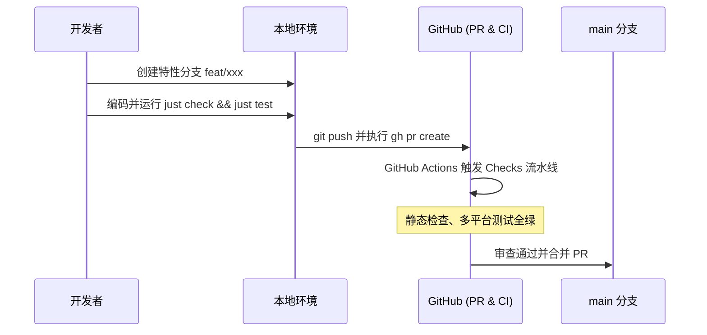

# 贡献指南

本项目为纯编排层系统，遵循云端统一构建与自动化分发哲学。本地开发专注于功能实现与质量门禁，所有生产级发布产物均由 GitHub Actions 流水线自动化构建与签名发布。

## 一、开发环境准备

系统依赖以下标准工具链：

- [Bun](https://bun.sh)：用于 TypeScript 运行时、依赖管理与测试驱动
- [just](https://github.com/casey/just)：统一任务调度器
- [GitHub CLI (gh)](https://cli.github.com)：用于自动化 PR 与 Release 操作

## 二、本地开发与质量门禁

日常开发遵循测试驱动与静态分析约束，提交代码前必须确保门禁全绿：

```bash
# 格式化代码
just fmt

# 静态类型检查与规范校验
just check

# 执行全部测试套件
just test
```

## 三、协作与 PR 流程

项目严格采用 PR 模式协作，禁止直接向 `main` 分支推送业务代码：



1. 基于 `main` 分支拉取最新代码并创建特性分支；
2. 完成功能开发与本地验证，确保 `just check` 与 `just test` 100% 通过；
3. 推送分支并通过 `gh pr create` 发起 Pull Request；
4. 等待 GitHub Actions Checks 流水线验证通过后合入主干。

## 四、版本发布标准流程

版本发布必须在 `main` 分支独立执行，严禁在特性分支夹带发版操作：

```mermaid
flowchart TD
    Merge[PR 合并至 main] --> CheckoutMain[切换至 main 并拉取最新代码]
    CheckoutMain --> BumpVersion[执行 just bump <version>]
    BumpVersion --> Commit[git commit -m 'chore(release): bump version to x.y.z']
    Commit --> Tag[git tag vx.y.z && git push origin vx.y.z]
    Tag --> CloudRelease[GitHub Actions release.yml 构建跨平台二进制并发布 Release]
```

1. **拉取主干最新代码**：
   ```bash
   git checkout main && git pull origin main
   ```

2. **同步版本号**：
   使用配方同步更新 [package.json](package.json) 与 [version.ts](src/domain/version.ts)：
   ```bash
   just bump <version>
   ```

3. **创建独立发布提交并推送**：
   ```bash
   git add package.json src/domain/version.ts
   git commit -m "chore(release): bump version to <version>"
   git push origin main
   ```

4. **打标并触发云端构建**：
   ```bash
   git tag v<version>
   git push origin v<version>
   ```
   推送 Tag 后，GitHub Actions 自动触发 release.yml 流水线，完成跨平台二进制与单文件脚本的编译、校验和生成以及 GitHub Release 发布。

## 五、本地运行态更新

当云端 Release 发布完成后，在本地开发机执行更新配方：

```bash
just update
```

该配方会自动通过 GitHub CLI 获取最新发布的单文件脚本，覆盖更新至 `~/.local/bin/stealth-cli`，并重新就绪上游调度垫片。
